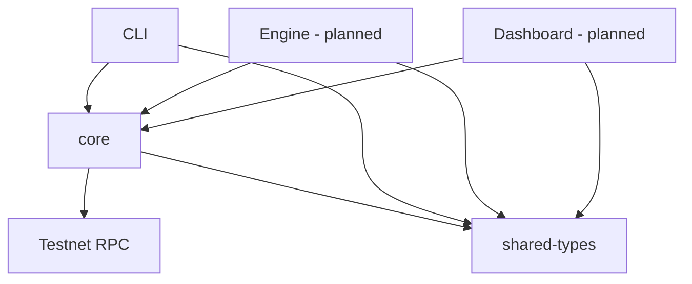
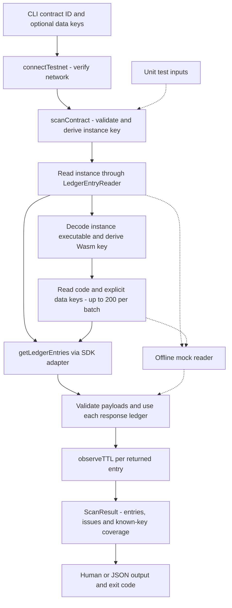
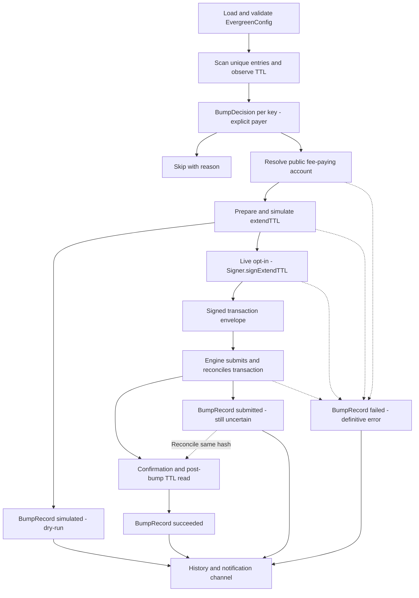

# Architecture

Read alongside [PRD](PRD.md) (product scope), [Soroban primer](SOROBAN-PRIMER.md) (ledger semantics), and [shared types](../packages/shared-types/README.md) (the data contracts). Task: `W1-D6-02`, [issue #32](https://github.com/Fatihmaull/evergreen/issues/32).

## What exists today

As of 2026-09-08, the implemented product path is **a Testnet scan of instance/code plus explicit persistent/temporary keys through the CLI**. The table distinguishes working code from the target architecture below. The database decision does not imply an engine or database adapter exists.

| Component | Implemented | Planned work |
|---|---|---|
| `packages/shared-types` | JSON-compatible interfaces, examples and compiler checks; no runtime I/O | Real producers/adapters validate input and uphold these contracts. ADR-005 was accepted in PR #58; runtime adapters remain planned. |
| `packages/core` | Testnet RPC reader, four-entry known-key scan, TTL math, unique-entry count | Cross-contract consumer deduplication (`W2-D8-04`), rent model, optimizer and decision rules |
| `packages/cli` | `scan <contract-id> [--keys-file <path> | --no-data-keys] [--json]`, coverage, human output and exit codes | Config loading, multi-contract scans, rent output, `extend`, `optimize` and full CLI UX |
| `packages/engine` | Package placeholder; separate read-only scheduler smoke proof | Scheduled decision/sign/send/reconcile loop and notifications in W3 |
| `apps/dashboard` | Static placeholder for the Pages deploy task | Public scan/history UI in W4; user-signed extension is P1 |
| `evergreen-check` | CLI exit-code contract available | Published Action wrapping the CLI in W4; repository CI currently runs offline tests |

The [mock RPC reader](../packages/core/test/mock-rpc.ts) is already implemented (`W1-D6-03`, PR #42). It supplies the same `LedgerEntryReader` interface as the SDK adapter and replays recorded entries, with omission and transport-error cases. Unit tests do not hit Testnet.

## Shape

The dependency direction is consumers → core/shared types. `core` never imports the CLI, engine or dashboard. Shared types contain no SDK dependency, secret or runtime behavior.



This is a dependency diagram. The following diagrams show data movement.

## Entries are shared; contracts are not the unit

**The ledger key is the unit of work.** Contracts deployed from identical Wasm share one `ContractCode` entry. The input may contain several contracts while one expiring entry affects them all.

`ScanResult.entries` is a map from canonical base64 XDR `LedgerKey` to `LedgerEntryTTL`. Each value carries its consumer `contracts`, observation ledger, entry kind, end behavior and TTL. Consumer IDs refer to the input contracts known to use the entry; they are not a census of the network.

The full scanner must canonicalize and deduplicate keys **before** rent calculation and decisions, merge unique consumer IDs, and handle conflicting observations. Rent is summed once per unique entry. Severity considers the number of affected consumers; the exact ranking remains decision/UX work. The engine must act once per unique key within a run (`W3-D16-02b`).

**Current limit:** `scanContract()` discovers code and reads explicit data keys for one contract. It canonicalizes duplicate supplied keys but does not combine consumers across contracts (`W2-D8-04`). Legacy `scanInstances()` remains exported; it deduplicates requested instance keys while retaining repeated input consumer IDs. The type shape alone cannot enforce consumer uniqueness.

### Example: two contracts, one code entry

This illustration focuses only on shared code, omitting the contracts' separate instance/data entries. A, B and K are explanatory labels, not real addresses or XDR. The figures are synthetic, not a rent quote or transaction result.

```text
ScanResult
  network: testnet
  contracts: [{ id: A }, { id: B }]
  entries:
    K:
      kind: code
      endBehavior: archived
      contracts: [A, B]
      observedAtLedger: 100
      ttl: { status: known, endsAtLedger: 100, remainingLedgers: 0 }
  issues: []
  rentEstimate:
    estimatedAtLedger: 100
    extendToLedgers: 1000
    estimatedRentStroopsByEntry: { K: "2500" }
    totalEstimatedRentStroops: "2500"
```

K is still live at ledger 100: `endsAtLedger` is inclusive. Both consumers are affected by its expiry, but there is one entry and one 2,500-stroop estimate, not two charges. The existing [compiler-checked example](../packages/shared-types/test/examples.ts) exercises this shape with a synthetic second consumer and a large exact stroop amount; it does not prove live code-entry discovery.

If K needs extension, a future `BumpDecision` carries `entryKey: K`, `contracts: [A, B]` and one explicitly resolved `payer`. When both contracts reference the same payer, that reference is unambiguous. When they nominate different payers, selection remains a runtime policy to settle; choosing the first contract silently is invalid. `action: 'skip'` can carry the unresolved-payment reason. No fee splitting or hosted billing is implied.

## The property everything else rests on

**TTL extension is permissionless.** A fee payer can submit `ExtendFootprintTTLOp` without authority over the contract (see the primer and recorded permissionless proof). A signature authorizes a payment, never access to a user's contract.

The user always pays their own extend fees ([ADR-004](adr/ADR-004-payment-model.md)). In the self-hosted engine, the user supplies their own capped operational fee balance. Evergreen never subsidizes another party's rent. A payer need not be the contract owner.

## Modules

### `packages/shared-types`

[Source declarations](../packages/shared-types/src/index.ts) define the interfaces below; [ADR-005](adr/ADR-005-shared-domain-types.md) records the accepted representation. Runtime code must validate canonical keys, addresses, thresholds and payer references. Types do not validate JSON or enforce signer security.

| Value | Producer → consumer | Meaning |
|---|---|---|
| `ContractRef` | CLI input / future config loader → core | Contract ID and optional display label |
| `LedgerEntryTTL` / `ScanResult` | Core scanner → CLI; later engine/dashboard | Entry-key map, per-entry TTL observation, input contracts and issues |
| `RentEstimate` | Planned core rent model → CLI/engine/dashboard | Estimate ledger, requested lifetime, cost per unique key and total |
| `EvergreenConfig` | Planned runtime loader → CLI/engine | Network, default/per-contract thresholds, contract-to-payer references and notification settings |
| `BumpDecision` | Planned decision rules with resolved payer → engine | Extend one key with a target/payer, or skip with a reason |
| `Signer` / `ExtendTTLSigningRequest` | Engine resolves signer per payer → signer adapter → engine | Prepared envelope and Testnet passphrase in; signed envelope out |
| `BumpRecord` | Planned engine → history / notification channel / dashboard | A specific attempt's outcome, entry, consumers, payer and known evidence |
| `NotificationChannel` | Planned engine → email transport | `notify(record)` consumes a bump record; the channel owns private destination configuration |

Money is integer stroops encoded as decimal strings. Consumers can calculate with `BigInt` and serialize back to text; converting fees to JavaScript `number` can lose precision. An omitted `rentEstimate` means no estimate is available, not zero rent.

### `packages/core`

The [RPC adapter](../packages/core/src/rpc.ts) isolates SDK entry reads behind `LedgerEntryReader`. [Scan assembly](../packages/core/src/scan-contract.ts) uses that interface, and [TTL math](../packages/core/src/ttl.ts) has no I/O. Rent estimation, optimization and decision rules remain planned core capabilities. Future rent calculations must use network fee parameters and sum unique keys; decisions remain separate from transaction execution.

### `packages/cli` — `evergreen`

The [entry point](../packages/cli/src/bin.ts) parses a single contract ID, calls core, prints human or JSON output, and sets an exit code. It currently uses a fixed threshold of 17,280 ledgers and `SOROBAN_RPC_URL` or the default Testnet endpoint. It does not load `evergreen.config.json` yet. The published package name and install/`npx` instructions remain subject to the npm setup decision (`W1-D5-01`); the executable can remain `evergreen` through its `bin` mapping.

### `packages/engine`

A scheduled job on Actions + Node 24, not a daemon ([ADR-001](adr/ADR-001-scheduled-serverless-engine.md), [ADR-003](adr/ADR-003-toolchain-hosting-persistence.md)). The real loop is planned for W3. The existing [scheduler smoke workflow](../.github/workflows/scheduler-smoke.yml) reads A's instance only and never signs or sends a transaction.

The engine resolves a `Signer` per payer. Stage 1 uses a plain funded Ed25519 account; Stage 2 adds the capped policy signer ([ADR-002](adr/ADR-002-policy-signer-provider.md), [policy signer plan](POLICY-SIGNER.md)). The same interface supports both. The adapter must verify network, payer, permitted operations and fee policy before signing; its method name does not provide those protections.

### `apps/dashboard`

The planned W4 P0 product is public and read-only: permissionless scans for any contract ID, plus history for contracts monitored by the demonstration instance. For other contracts, history says "not monitored by this instance"; it does not imply nobody protects them. There are no accounts or registration flows. Pages hosting preparation is separate from the engine runtime and database decision.

P1 adds an explicit user-initiated, user-signed payment to extend TTL. The dashboard never auto-bumps. The complete P0 scan/history experience must stand on its own if P1 is cut; no dead write controls or auth-gated empty views.

### `evergreen-check` (GitHub Action)

The planned published Action wraps CLI `scan` and consumes its exit code and JSON output. Repository test CI and the scheduler smoke workflow are separate from this future product.

## Data flow, end to end

### Current path: Testnet known-key scan



Scanner/CLI unit tests inject a mock reader. Separate adapter tests stub SDK methods; neither path contacts the network.

1. The CLI validates arguments and the optional keys-file shape. `connectTestnet()` checks `getNetwork()`'s passphrase before any entry read.
2. `scanContract(reader, contract, dataKeys)` validates the contract and supplied keys. Only persistent/temporary `ContractData` keys for that contract are accepted. Whitespace is normalized, duplicate keys count once, and invalid input becomes an issue.
3. The instance is read first; its payload supplies the Wasm hash used to derive the code key. Non-Wasm executables produce `unsupported-executable`. If the instance is missing, explicit data keys can still be read, but no code key is invented.
4. Code and explicit data keys are read in batches of at most 200. The adapter retains payload XDR, key and optional TTL. The scanner validates payload/key correspondence and discards duplicate or malformed observations. Failed batches leave earlier successful results available.
5. `observedAtLedger` comes from each batch's own `latestLedger`. Remaining TTL is `liveUntilLedgerSeq - observedAtLedger`: zero is still live, negative is expired. Missing metadata becomes `unavailable`. A missing requested entry produces `entry-not-found`, not proof of archival, deletion or prior existence.
6. Human output and JSON state `known-keys` coverage, with the unique validated explicit data-key count. The scanner never claims to enumerate contract storage. Approximate dates remain display projections. Issues produce a PARTIAL warning.

Current CLI exit behavior, in precedence order:

| Condition | Exit |
|---|---|
| Invalid input/response, RPC failure or network refusal | `2` |
| Unknown coverage, unavailable TTL, missing/unsupported entries or no observations | `3` |
| All observations are available and any TTL is below 17,280 ledgers | `1` |
| All supplied/discovered entries have known TTL at or above threshold and no issues | `0` |

Zero covers only the supplied/discovered keys, never all contract storage. Precedence is 2 > 3 > 1 > 0. Legacy results without coverage now return 3. `--no-data-keys` is a caller assertion stored in `coverage.noDataKeysDeclaredByContract`, mutually exclusive with a keys file; an empty keys file is not that assertion. JSON retains low-TTL observations even when incomplete/error takes precedence. Exit status is a CI health summary, never authorization to spend. The engine consumes structured observations and policy/payer/budget inputs before deciding to bump. [ADR-006](adr/ADR-006-scan-health-exit-codes.md) records this proposal for shared review. Cross-contract consumer merging remains `W2-D8-04`; severity presentation remains `W2-D10-01`.

### Planned path: decide, pay, confirm, record

This is the W3 target flow, not an implemented engine. The current CLI does not run it.



The future loader validates contract-to-payer references and merges threshold overrides. Config contains environment variable names or policy references, never secret values. An omitted `mode` must become `dry-run`; live submission requires explicit opt-in. `extendToLedgers` is the requested lifetime relative to execution, not an absolute ledger number.

Decision rules consume observations/thresholds and an explicitly resolved payer for an extend decision. Shared entries produce one decision, not one per consumer. A skip is a decision with a reason, not automatically a successful engine run: `W2-D10-04` requires a visible nonzero outcome when an observed entry is below threshold and no bump happened. Whether temporary entries should be auto-bumped remains the explicit scope decision `W3-D15-02b`; scanning them does not authorize keeping them forever. PR #58 separately confirms that reporting imminent temporary-entry deletion as high severity is W2 work and does not wait on that policy decision.

The engine must resolve the payer's public account before preparing the envelope, even for simulation. A payer ID is a config lookup key, not itself an account address; a resolved signer's public `identity.account` can supply that identity. Resolving identity does not mean a signature has been produced. The exact loader/adapter wiring remains W3 work.

`Signer.signExtendTTL({ networkPassphrase, transactionXdr })` returns a signed XDR envelope. It **does not submit**. The engine orchestrates transaction preparation, simulation, signing, submission and reconciliation through adapters. Stage 1 and Stage 2 change the signer implementation, not the data contract.

A record carries `entryKey`, consumer `contracts`, `payer`, target, reason, `recordedAt`, and a `before` observation. `recordedAt` is an event timestamp; TTL remains measured in ledgers.

| `BumpRecord.outcome` | Meaning and fields |
|---|---|
| `simulated` | Dry-run; no transaction hash or `after`. Signer identity is optional because simulation does not prove signing. |
| `submitted` | Live, with signer identity and hash; confirmation or the post-bump TTL observation is still outstanding. No `after` yet. |
| `succeeded` | Live, transaction confirmed **and** after-TTL verified; signer, hash and `after` required. `paidFeeStroops` is optional exact decimal text. |
| `failed` | Definitive attempt failure with a sanitized error. Signer may be unresolved; a live failure may have a hash, while a dry-run failure cannot. No `after`. |

A lost acknowledgement or unresolved transaction is not sufficient to declare failure and send again. Reconcile the known hash first; do not invent a successful `after` observation. History must distinguish these outcomes. Notification transport and routing are W3 work; a simulated or submitted record must not be presented as a successful live bump. Failure reporting also has to cover errors before a valid `BumpRecord` can be formed, such as a scan failure (`W3-D17-05`).

## Persistence

[ADR-003](adr/ADR-003-toolchain-hosting-persistence.md) accepts **Actions + Node 24, with PostgreSQL on Neon adopted in W4 after the Sep 20 proof**. W1 does not require a hosted database. The unused spike was merged separately in [PR #52](https://github.com/Fatihmaull/evergreen/pull/52); it remains an experiment outside the engine runtime.

**Frame the choice as atomicity, not storage.** ADR-001 accepts that scheduled runs can overlap, and `W3-D16-02` promises we never double-bump an entry. That guarantee needs a durable write the engine can use as a lock or a last-bumped record — so the question is *"what gives a scheduled job an atomic-enough write?"*, not *"where do we keep history?"*. The two questions pick different answers: JSON committed to the repo is adequate history and useless as a lock, which disqualifies it.

| Stage | Coordination and history |
|---|---|
| Current W1 | Read-only smoke workflow; no engine history writer. The smoke uses one `scheduler-smoke` concurrency group and does not cancel an active run. |
| Planned W3 | Verify serialization for the real engine workflow (`W3-D16-02`) and dedupe within each run (`W3-D16-02b`). Re-read on-chain TTL after confirmed work, while separately handling transactions still in flight. Write records to Actions summaries/artifacts and capture same-day committed evidence (`W3-D16-03`). |
| Planned W4 | Adopt PostgreSQL only after pending-hash reconciliation and failed-outcome history support are implemented. Verify actual Neon settings/usage before migration (`W4-D26-05`), plus hosted connection, permissions and pooling behavior. |

A workflow concurrency group coordinates only runs using that group in the repository. It does not serialize independent installations or settle a chain transaction still pending after a runner stops. A confirmed bump visible in a fresh TTL scan can suppress unnecessary work; that is distinct from recovering an uncertain send.

The spike deliberately refuses to reclaim pending work on lease expiry, and its history accepts only successful outcomes. Adoption needs chain reconciliation, not timer-based release, and a writer that can record failures. The experiment establishes neither production readiness nor exactly-once chain execution. A local SQL write and a Stellar submission are not one atomic transaction.

Summaries and uploaded artifacts help inspect a run but have retention limits. For every new Testnet transaction, commit the hash, **full unedited RPC response and explorer screenshot** with [EVIDENCE.md](EVIDENCE.md) the same day. This durable proof is independent of the later dashboard history source. The W4 dashboard reader is still to be implemented; there is no live history API today.

## Boundaries we're deliberately holding

- Testnet only. No mainnet mode or real-funds key.
- Permissionless extension; signatures authorize fee payment. The self-hoster supplies their own fee-paying account and secret on their own runtime. No user's key is entrusted to an Evergreen-hosted service, and no authority over the monitored contract is needed.
- No subsidized rent or hosted multi-tenant service in v1. The N-contracts/M-payers shape supports future evolution without implementing custody or billing.
- Dry-run defaults for transaction paths; live submission is explicit.
- P0 dashboard must ship complete and read-only; P1 signing is removable. Automated bumping belongs to the engine.
- Email is the planned v1 notification transport; webhook/Telegram channels are SOW 2 extensions, not implemented transports today.
- Unit tests use the recorded fixture/mock reader; network integration is explicit and separate from ordinary CI.
