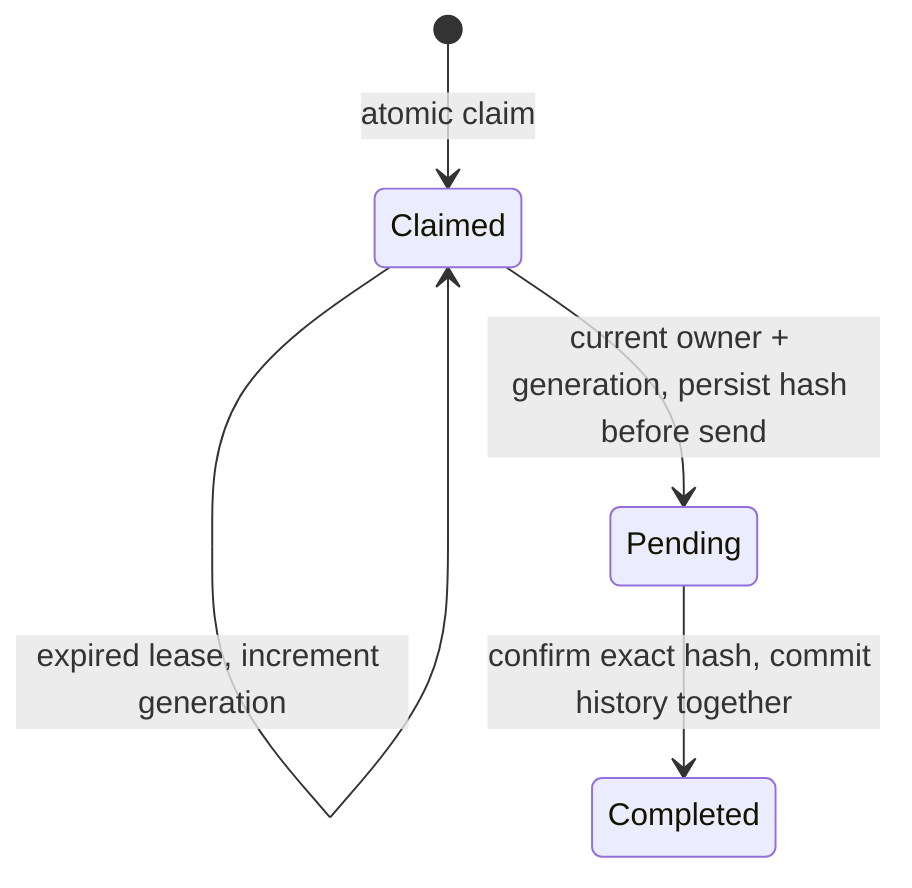

# ADR-003: Toolchain, hosting, scheduler, and persistence

**Status:** Accepted for W1-D6-04 in PR #48, with follow-ups in PR #49: Actions + Node 24; PostgreSQL on Neon adopted in W4 after the Sep 20 proof. The local spike is an unused experiment with adoption prerequisites below. W1 requires no hosted database. Dashboard hosting is separately settled on Pages; deployment remains W1-D5-02.
**Date:** 2026-09-04
**Deciders:** Fatih, Rakha

## Context

Four infrastructure choices were left open at planning time. Toolchain was settled first. Hosting, scheduling, and persistence are related, but their proofs now have separate backlog tasks: dashboard hosting at `W1-D5-02`, a scheduler smoke test at `W1-D5-03`, and an atomicity probe at `W1-D6-04`.

## Part 1 — Toolchain (decided)

**Node 24 LTS**, pinned via `.nvmrc`. **pnpm workspaces** for the monorepo. **TypeScript strict** from `tsconfig.base.json`. **ESLint (flat config) + Prettier.**

**Test runner: Vitest, not Jest.** Native ESM and TypeScript with no transform layer to configure, first-class workspace support matching our pnpm layout, and `vitest --coverage` via v8 needs no extra plumbing for the coverage report the SOW requires as evidence. Jest is the more familiar default and would work; it costs a `ts-jest`/babel transform config in every package, which is exactly the kind of setup tax a 30-day sprint should not pay. Reversible if it disappoints — the test API surface we use is nearly identical.

## Part 2 — Evaluation history

The following records the options and scheduler proof considered before the [accepted decision](#part-2--decided-2026-09-08). Earlier open/proposed wording is historical.

### Scheduler choice — local, manual GitHub, and scheduled verification complete

Use **GitHub Actions with Node 24** as the initial scheduler, at a nominal 15-minute cadence. The repository already uses that runner/toolchain for CI, and each run exposes its event, commit, exit status, and logs for review. This follows the existing `W1-D5-03` option to use Actions first and defer additional hosting decisions.

The read-only smoke script pins `@stellar/stellar-sdk` **17.0.1** and calls `getNetwork()` followed by `getLedgerEntries()` for guinea-pig A's instance. On 2026-09-06 it succeeded locally on **Node 24.13.0**, verifying the Testnet passphrase and reading a live TTL. See the [runtime record](../evidence/2026-09-06-scheduler-smoke/README.md). This verifies the two SDK read paths; signing and engine execution are later tasks. Cloudflare Workers was **not tested** in this task; its compatibility is still unknown.

The workflow provides `workflow_dispatch` and a UTC schedule at minutes `7,22,37,52`. Both require the workflow to exist on the default branch. [PR #24](https://github.com/Fatihmaull/evergreen/pull/24) merged on 2026-09-07. Manual run [34110254224](https://github.com/Fatihmaull/evergreen/actions/runs/34110254224) and genuine `schedule` run [34111732199](https://github.com/Fatihmaull/evergreen/actions/runs/34111732199) then succeeded on `main` (`5509c44`), verifying SDK 17.0.1 reads on the hosted Node 24.20.0 runner. Full logs and metadata are in the [GitHub runtime record](../evidence/2026-09-07-scheduler-runs/README.md). **The `W1-D5-03` runtime proof is complete.** Exported evidence merged in [PR #27](https://github.com/Fatihmaull/evergreen/pull/27) (`741ae61`), closing Issue #23.

GitHub schedules are [best-effort and may be delayed or dropped](https://docs.github.com/en/actions/reference/workflows-and-actions/events-that-trigger-workflows#schedule); 15 minutes is not a maximum reaction time. The engine's future threshold and missed-run handling must tolerate that. Workflow concurrency limits smoke-test overlap, but does not supply a durable per-entry lock: that remains `W1-D6-04` and the Week 3 engine implementation.

This workflow only reads public Testnet data. It needs no signing secret, account funding, database, or email integration.

### The question to ask

Frame persistence as **atomicity, not storage.** ADR-001 accepts that scheduled runs can overlap; `W3-D16-02` covers in-flight transactions across runs. That requires a durable write usable as a lock and a persisted pending-transaction record; a last-bumped timestamp alone cannot close the gap between sending and recording success.

Asked as "where do we keep bump history?", flat JSON committed to the repo looks adequate. Asked as "what gives a scheduled job an atomic-enough write?", it is disqualified. Same decision, different answers — ask the second question.

### Shortlist

| Platform | Cron | State / locking | Notes |
|---|---|---|---|
| **Cloudflare Workers + D1** | Cron Triggers, 1 min minimum | D1 transactional lock row gives real atomicity. KV is eventually consistent and **not** safe as a lock under contention. | Purest fit for ADR-001, generous free tier. **Blocking risk: Workers is not Node.** Verify the Stellar SDK actually runs there (`nodejs_compat`, crypto/buffer deps) before committing. |
| **Railway** | Cron as a service type; runs the container's start command on schedule | Volumes + managed Postgres | Plain Node runtime, so zero SDK-compatibility risk. Bills per second, idle ≈ free; Hobby $5/mo. Lowest-surprise option. |
| **Render** | Native cron jobs | Managed Postgres | Near-identical to Railway; choose on account/DX preference rather than capability. |
| **GitHub Actions cron + hosted DB** (Neon / Turso / Supabase) | Scheduled workflows | External DB provides the lock; Actions alone provides none | Public run logs are easy to review; export the proof logs for grant evidence. **Risk: scheduled workflows are best-effort and can be delayed well past the interval** — the threshold design must tolerate it and a missed run must alert. |

> ### ⚠️ Having a Cloudflare account does not decide persistence
>
> Once the account exists for Pages there is an obvious pull toward *"we're on Cloudflare anyway, so D1."* **Resist it.** The two parts are separable and only one is blocked:
>
> | Part | Status | Blocked on the SDK question? |
> |---|---|---|
> | Dashboard hosting | **Settled — Cloudflare Pages** | No. Pages is static hosting and never touches the Stellar SDK. |
> | Engine runtime + persistence | **Open; Actions + Node + PostgreSQL proposed** | Full SDK compatibility remains unverified for the Workers option; Actions already has a hosted scheduler/read proof. |
>
> The compatibility question now has a bounded answer: **SDK import, instance-key XDR and Testnet reads passed in local Workers** (see [the recorded result](../evidence/2026-09-08-persistence-spike/README.md#workers-read-path)). Deployment, cron, signing and D1 remain unverified. This establishes local read compatibility, not full engine compatibility or a reason to select D1. If Workers cannot support the engine, reaching D1 from another platform remains an avoidable coupling.
>
> Answer the SDK question on its own merits, timeboxed to one afternoon. If it stays ambiguous past that, **the ambiguity is the answer** and the Actions cron floor carries us.

### Dashboard hosting is a *separate, much smaller* question

Worth separating explicitly, because the shortlist above is about running the **engine** and it does not apply here.

**The P0 dashboard needs no backend.** Scanning is a permissionless read, so the browser calls Soroban RPC directly — there is no server-side secret, no signing, and nothing to keep warm. Bump history is the only server-shaped need, and it is read-only; it can be fetched client-side from whatever ADR-003 Part 2 chooses, or published as a static JSON artifact.

So the dashboard is a **static site**, and Vercel, Netlify and Cloudflare Pages are functionally identical for it — all free at our scale, all deploy from a GitHub push. **This decision does not deserve deliberation**; it deserves whichever account exists already.

**Cloudflare Pages selected in PR #45.** The same account can support a deployed Workers probe if that option needs further evaluation; the local SDK read probe required no account. Dashboard account setup and deployment are tracked in [Issue #46](https://github.com/Fatihmaull/evergreen/issues/46) and do not select the engine runtime or database.

### Evaluation order

1. Does the Stellar SDK run there at all?
2. Can it give a real lock?
3. Cost.
4. How easily can a non-technical reviewer see it working?

### Constraint from ADR-004

Whatever is chosen must not model "the bot account" as a process-wide singleton. The schema needs `BumpRecord.payer` distinct from the contract, and config shaped as N contracts × M payers. v1 need not implement multi-tenancy — it must not foreclose it.

## Part 2 — DECIDED 2026-09-08

**Runtime: GitHub Actions cron + Node 24. Persistence: PostgreSQL on Neon — adopted in Week 4, deliberately NOT before the Sep 20 proof.**

### Runtime

Actions cron is already proven end to end: a genuine `schedule` event read testnet successfully (`W1-D5-03`). A bounded local Workers probe passed SDK import, XDR and testnet reads via `wrangler dev --local`, but deployment, cron, signing and D1 remain unverified. That is enough to stop spending time on Workers, not enough to move to it ten days before a gate.

### Why persistence waits — the load-bearing reason, and the rest

**Read the separation before the arguments.** Three of the four reasons originally given for waiting were later narrowed or refuted by the spike author (see *Corrections* below). The decision did not change, because it never rested on them. Stating which leg carries the weight so that **refuting a supporting observation cannot be mistaken for refuting the decision.**

#### 🟢 LOAD-BEARING — this alone is sufficient

**The ledger is the durable, idempotent source of truth, and the risk asymmetry is inverted.**

After a confirmed bump that raises `remainingLedgers` above threshold, the next run scans and skips. If TTL is still low, a previously submitted transaction may still be pending: reconcile its hash and validity bounds before preparing a new send. The ledger is the source of current need; it is not by itself a no-double-submit guarantee. See **Reconcile in-flight transactions with chain data** below.

So a fail-closed lock in front of a single-shot, unrepeatable deadline gets the risk backwards. **A double bump costs a few testnet stroops and a duplicate row, and damages no evidence. A stalled lock costs the proof.** Guinea-pig B's 24-hour window is ~96 independent attempts; a held claim converts all 96 into one.

This holds at any provider, any quota, any autoscale ceiling. Nothing measured later can weaken it.

#### 🟡 SUPPORTING — true enough to mention, individually refutable

- **Neon's free-tier arithmetic.** 2,880 runs × a 300s idle window = 240 compute-hours against a 100-hour allowance, exhausting on the crossing date at a 1.0 CU ceiling. **This is an upper bound assuming ceiling-rate compute, not a prediction** — actual consumption depends on average usage and could be materially lower. It is a reason to *measure before provisioning*, not proof of exhaustion.
- **Cloudflare Workers quota is account-wide.** The account is shared and already runs another Worker, so published free-tier figures overstate our headroom. Unmeasured.
- **The scheduler concurrency guard.** `concurrency:` with `cancel-in-progress: false` plus `timeout-minutes: 5` under a 15-minute cron. **This governs runs, not chain state** — see immediately below.

#### Reconcile in-flight transactions with chain data

An earlier draft of this ADR claimed overlap was "structurally impossible." **That was wrong**, and it is on record as wrong, so here is the correct version rather than leaving a reader to rederive it.

A concurrency group serialises *workflow runs*. It says nothing about a transaction already submitted to the network. The real case it skips: **a run submits `extendTTL`, dies before confirming, and the next run has no idea whether it landed.**

**Chain observations answer two different questions.** A fresh TTL above the threshold means no new extend is needed for that entry at that observation; it does not prove that a particular transaction succeeded, because another party can also extend it. TTL still below the threshold does not prove that an earlier submission failed: it may still be in flight.

Resolve a known transaction hash with `getTransaction()` and its validity bounds before deciding whether to construct a replacement. `NOT_FOUND` alone is not a final failure. Resending the same signed envelope and constructing a new transaction with another sequence number are different actions. Keep uncertain outcomes `submitted`; only confirmation plus an after observation justifies `succeeded`. See the [RPC reference](https://developers.stellar.org/docs/data/apis/rpc/api-reference/methods/getTransaction) and [transaction error handling](https://developers.stellar.org/docs/data/apis/horizon/api-reference/errors/error-handling). This clarification preserves the database deferral; it does not implement the W3 recovery path.

This is precisely why `getTransaction()` reconciliation is the right prerequisite for adopting the spike, and why a lease timer is the wrong fix: a timer guesses at what the chain can be asked.

### The asymmetry that settles it

Restated for emphasis, because it is the load-bearing half above: a double bump costs stroops; a paused, cold or stalled coordination layer on a Sunday costs the least recoverable proof in the grant. **Any coordination added before Sep 20 must fail *open*.** The spike's — correctly, for its own stated goal of never double-sending — fails closed.

### ⚠️ Unmeasured assumption — read this before provisioning anything

**We have not provisioned or measured a Neon project.** W4-D26-05 must verify its autoscale range, actual average compute use, active time and quota/reset settings. The 0.25/1.0 CU calculations above assume sustained average use at those levels; the ceiling alone does not establish a consumption rate or exhaustion date.

**Measuring it is the first step of Week 4 adoption, before any migration runs** — not a detail to resolve while wiring things up. An unmeasured assumption written down is a task; left in a comment it is a trap.

**And it is not the load-bearing argument.** The decision to wait rests on three things that hold at *any* ceiling:

1. The current smoke workflow already serializes its runs; the real engine workflow must verify the same bounded guarantee.
2. Confirmed on-chain TTL lets a fresh scan skip unnecessary work; uncertain submissions still require reconciliation.
3. The cost asymmetry runs backwards — a fail-closed lock in front of a one-shot, unrepeatable deadline.

So even at 0.25 CU with room to spare, provisioning before Sep 20 would still be wrong. **If you are reading this in Week 4 and reaching for Neon: the decision was about *when*, and these three reasons are why — re-read them before assuming the wait was only about quota.**

### A second unverified quota assumption — Cloudflare, discovered 2026-09-08

The Cloudflare account created for Pages is **shared, not fresh**: it already runs the domain `focustudio.online` and a Worker named `focuswebstudio`.

Irrelevant to Pages. **Relevant here, because Workers free-tier limits are per *account*, not per project** — an existing Worker already consumes part of any budget a future engine would have. So if Workers is ever revisited, the available headroom is not the published free-tier figure.

**That makes two providers and two unverified quota assumptions** — Neon's autoscale ceiling and Cloudflare's account-wide Workers budget. Both belong to the Week 4 revisit, before anything is provisioned, and neither changes the decision to wait.

### Corrections from the spike author, 2026-09-08

Recorded because they narrow claims made above, and an ADR that only keeps the flattering half of a review is not a record:

- **Neon CU-hours depend on average compute usage, not the ceiling alone.** The 240-hour figure above assumes billing at the ceiling for the full idle window; actual consumption could be materially lower. The arithmetic remains a reason to *measure before provisioning* rather than a proof of exhaustion.
- **The spike uses conditional row writes, not session advisory locks.** So the Supabase transaction-pooler concern — that a pooler silently breaks session-scoped locks — does **not** apply to this implementation. It remains a real hazard for anyone who reaches for advisory locks later.
- **A workflow concurrency group only coordinates runs in the same group.** It prevents overlapping *runs*; it does not resolve a transaction already in flight on chain. So "overlap is structurally impossible" is true of the scheduler and not of the chain, which is exactly what the `getTransaction()` reconciliation prerequisite exists to cover.

### Prerequisites for adopting the spike in Week 4

Both were reproduced against the spike's own code on local Postgres 16.15, 2026-09-08. **Neither may be inherited silently.**

1. **`pending` is terminal with no reconciliation path.** `claim()` takes over only `WHERE current.phase = 'claimed'`; `prepare()` sets `'pending'`. A process dying between `prepare()` and `complete()` strands the entry permanently. Measured: **0 non-null returns from 100 `claim()` attempts** past lease expiry. This is deliberate and fail-closed — `prepare()`'s comment reads *"Pending work never expires into a new send"* — so the fix is **not** a timer, which would reintroduce the double-send it prevents. It is reconciliation: resolve the stored `transaction_hash` with `getTransaction()` and let the chain decide.
2. **Failed outcomes are unstorable.** `history` carries `CHECK (record->>'outcome' = 'succeeded')`. A `failed` record is rejected by the constraint while `succeeded` inserts — verified both directions. `BumpRecord` already distinguishes simulated/submitted/succeeded/failed, so the schema is narrower than the type it stores.

### What ships instead, before Sep 18

`W2-D10-04`: **the run exits non-zero when it observes an entry below threshold and did not bump it** — including when a claim is held. This converts the silent-skip failure into a loud one and matters more than the provider choice.

## Consequences

- The scheduler preparation adds a root development dependency for the standalone smoke script; it does not yet change the engine or core package APIs.
- The manual and scheduled smoke workflow stays separate from offline PR tests. A missing A instance or RPC failure exits nonzero; it does not redeploy or extend anything automatically.
- The first successful manual and scheduled run URLs, event types, commit SHAs, and full logs are captured and published in [PR #27](https://github.com/Fatihmaull/evergreen/pull/27), keeping the record available independently of GitHub log retention.
- Dashboard hosting, durable locking, and the real unattended-bump proof remain open under their own task IDs.

## 2026-09-08 — Local persistence spike: proposal for review

**Historical proposal, superseded by the accepted decision above.** The [local evidence](../evidence/2026-09-08-persistence-spike/README.md) informed the choice of Actions + Node and PostgreSQL on Neon, with adoption deferred to W4. The experiment remains unused and no hosted database was provisioned. Its local checks establish contention, lease fencing, pending protection and successful-history writes; they do not establish a production recovery protocol.

### What the local experiment establishes

Two independent Node processes start together and attempt the same `(network, canonical ledger key)` claim. PostgreSQL's [conditional `INSERT ... ON CONFLICT`](https://www.postgresql.org/docs/17/sql-insert.html) grants one claim. The persisted row, rather than a session advisory lock, protects the entry after the statement commits. Different ledger keys remain independent. Payer is deliberately excluded from the lock key, so two configured payers cannot bypass coordination for a shared entry in the same database.

The prototype uses three phases:

Before a send could occur, the current owner must persist its known transaction hash through an unexpired, generation-checked update. An expired pre-send claim can be taken over, while the old generation cannot progress. **Pending work never becomes available merely because its lease expires.** A retry must reconcile the known transaction, not construct another payment on a timer. If database confirmation is uncertain, do not send; reconcile persistence first. After confirmed chain success, history insertion and the completion marker belong in one SQL transaction. The probe deliberately rejects one history insert and verifies both writes roll back.

Two synthetic `BumpRecord`-shaped payloads round-trip through `jsonb`, retaining separate payer/signer identities and the exact string amount `9007199254740993` stroops. The real database persists these records across client exit and a new reader process. Shared types and payer-selection policy are unchanged.

**Scope limits:** this is a database protocol experiment, not the engine adapter. Its `complete` function receives synthetic confirmation and does not query a chain. It covers one claim cycle per entry; completed rows are not yet rearmed for a later TTL cycle. W3 still implements fresh TTL checks, uncertain-send handling, payer sequence coordination, per-key deduplication and the unattended-bump proof. Database migrations, the production claim adapter and its reconciliation/history prerequisites move to W4; W3-D16-03 records the interim artifact-based history path. Coordination applies only to cooperating runs sharing this database; it cannot prevent independent self-hosted installations from acting on the same entry. SQL and Stellar are not one atomic transaction, so this result is not an end-to-end exactly-once guarantee.

### Workers compatibility outcome

A bounded local `wrangler dev --local` experiment using Wrangler **4.129.1**, compatibility date **2026-09-08** and SDK **17.0.1** succeeded at SDK import, instance-key XDR, `getNetwork()` and `getLedgerEntries()` against Testnet A. [Source, response and reproduction steps](../evidence/2026-09-08-persistence-spike/README.md#workers-read-path) are preserved. The earlier “Workers unknown” note now narrows to **local reads verified; deployment, cron, signing, D1 and full engine unverified**. There was no Cloudflare deployment or transaction.

[Workers supports a subset of Node APIs](https://developers.cloudflare.com/workers/runtime-apis/nodejs/); its current compatibility date enables Node support without a flag. Passing two read methods cannot establish the rest of the engine. Workers is not rejected as incompatible, but this result gives no reason to replace the already proven Actions scheduler or implement a second database dialect during W1.

### Hosted evaluation deferred to W4

Neon is the accepted target. The original comparison below is retained as evaluation context; it does not reopen provider selection or authorize provisioning before the proof.

Both shortlisted providers offer PostgreSQL. The SQL uses short transactions and qualified table names, avoiding session-level locks and a provider SDK. Connection-mode compatibility remains a hosted test, not a conclusion from localhost.

| Option | Fit for this task | Hosted check still needed |
|---|---|---|
| Neon | Focused PostgreSQL service; no extra application services needed. [Connection pooling](https://neon.com/docs/connect/connection-pooling) uses PgBouncer transaction mode. | TLS, chosen endpoint, role permissions, contention, reconnect/cold-start behavior and current quotas. |
| Supabase | PostgreSQL works for the same protocol; Auth/Storage/Realtime are not required for this task. [Connection guide](https://supabase.com/docs/guides/database/connecting-to-postgres) distinguishes direct and pooler endpoints. | Choose an endpoint reachable from the runner: direct uses IPv6 by default; the shared pooler supports IPv4. Verify the same database checks. |

Provider cost is a later selection input, not measured by this probe. Check [Neon pricing](https://neon.com/pricing) and [Supabase pricing](https://supabase.com/pricing) at selection time, including idle/suspend behavior. Keep a small cap on compute and retention; no paid plan has been selected. If a provider's connectivity or pooling fails the same probe, try its documented compatible endpoint or the other PostgreSQL provider without rewriting the claim protocol.

### History access and operational boundary

The engine writes using a server-side database credential. The public dashboard receives only a read-only history projection/API or static export, never that credential. A public history artifact may be useful evidence but cannot serve as the coordination lock. Dashboard implementation and deployment remain their own tasks.

Root `pg` is a pinned development dependency for the isolated spike, not an engine package dependency. Ordinary tests stay offline; the database experiment requires `--run`, writes only a generated temporary schema, and attempts cleanup even after failure. A stopped local database was explicitly tested: connection failed, no work proceeded, and the command exited nonzero. W1 publication retains this experiment and its known limits. Hosted validation/adoption is deferred to W4; the accepted decision already unblocks W1-D6-02.

## Downstream sweep — artifact publication

This publication implements the accepted timing from PR #48/#49; it introduces no new runtime dependency for the engine.

- W1-D6-04 remains Done; W1-D6-02 is unblocked and can describe the interim history path without a hosted test.
- W2-D10-04 remains the visible-failure requirement; W3-D16-02 verifies engine workflow serialization and uncertain-send handling.
- W3-D16-03 records summaries, uploaded artifacts and same-day committed evidence in W3, plus database adoption prerequisites for W4.
- W4-D26-05 remains the pre-migration hosted-settings check. The broader backlog sweep landed separately in PR #51; this artifact does not implement or claim those future tasks.
- SETUP, EVIDENCE, this ADR's index and the spike README now distinguish the accepted decision from the historical proposal and unused implementation.

**W1 review clarification (`W1-D7-04`):** W3-D16-02 still owns uncertain-send handling, W3-D16-03 still owns the interim history, and W4-D26-05 still gates database adoption. ARCHITECTURE and the shared `BumpRecord` variants already require confirmation before success; their contracts remain unchanged. STATUS and the W1 review now use the same distinction between current TTL and transaction outcome. No provider, timing, dependency or task ownership changed.

## Update log

- 2026-09-04: created. Toolchain decided; hosting/scheduler/persistence deferred to W1-D5-03 with the shortlist and evaluation order above.
- 2026-09-06: selected GitHub Actions + Node 24 for the initial scheduler; verified SDK 17.0.1 reads locally. Workflow published for review in [PR #24](https://github.com/Fatihmaull/evergreen/pull/24), tracking [Issue #23](https://github.com/Fatihmaull/evergreen/issues/23); merge and scheduled-run proof pending. Hosting and atomicity remain separate tasks.
- 2026-09-07: PR #24 merged; manual run `34110254224` and genuine scheduled run `34111732199` succeeded. Their full logs and metadata were captured and cross-checked. Runtime proof complete, evidence published for review in [PR #27](https://github.com/Fatihmaull/evergreen/pull/27); no change to the platform decision or the separate hosting/atomicity tasks.
- 2026-09-08: local PostgreSQL contention/recovery spike and local Workers SDK reads verified. Proposed Actions + PostgreSQL; hosted provider explicitly deferred until local review. `W1-D6-04` remains In progress. Corrected the across-run task reference to the frozen `W3-D16-02` ID.
- 2026-09-08: integrated PR #45's separation of Pages hosting from engine/persistence, then reconciled its Workers question with the existing local read evidence. Runtime/provider agreement is requested through #30; Actions + Node + PostgreSQL remains a proposal. No hosted provisioning or additional compatibility experiment occurred in this follow-up.

- 2026-09-08: integrated PR #48/#49/#50; retained the unused experiment and review findings, deferred hosted validation to W4, and clarified that row claims do not use session advisory locks and quota scenarios depend on measured average usage. Runtime/provider/timing decisions are unchanged.

- 2026-09-08: W1 review clarified current TTL versus transaction outcome and propagated the distinction to STATUS and the W2–W4 handoff. No change to runtime, provider, adoption timing or shared interfaces.
