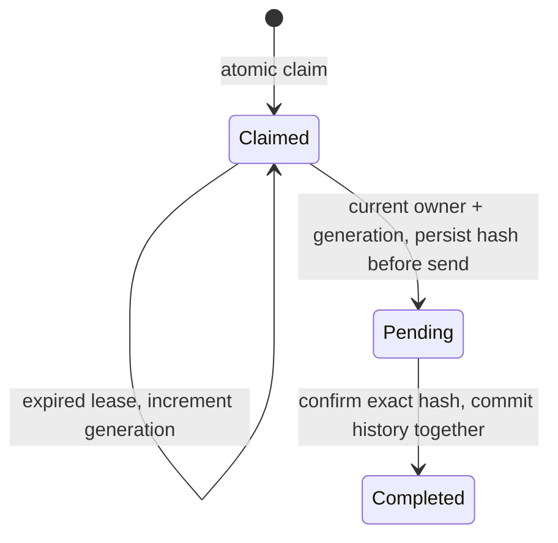

# ADR-003: Toolchain, hosting, scheduler, and persistence

**Status:** Partially decided — toolchain settled 2026-09-04 (W1-D3); GitHub Actions + Node 24 selected for the scheduler smoke test on 2026-09-06 (`W1-D5-03`), with manual and genuine scheduled reads verified 2026-09-07. PostgreSQL persistence is **proposed for review** after the 2026-09-08 local spike (`W1-D6-04`); hosted provider selection and validation remain open. Dashboard hosting remains a separate task (`W1-D5-02`).
**Date:** 2026-09-04
**Deciders:** Fatih, Rakha

## Context

Four infrastructure choices were left open at planning time. Toolchain was settled first. Hosting, scheduling, and persistence are related, but their proofs now have separate backlog tasks: dashboard hosting at `W1-D5-02`, a scheduler smoke test at `W1-D5-03`, and an atomicity probe at `W1-D6-04`.

## Part 1 — Toolchain (decided)

**Node 24 LTS**, pinned via `.nvmrc`. **pnpm workspaces** for the monorepo. **TypeScript strict** from `tsconfig.base.json`. **ESLint (flat config) + Prettier.**

**Test runner: Vitest, not Jest.** Native ESM and TypeScript with no transform layer to configure, first-class workspace support matching our pnpm layout, and `vitest --coverage` via v8 needs no extra plumbing for the coverage report the SOW requires as evidence. Jest is the more familiar default and would work; it costs a `ts-jest`/babel transform config in every package, which is exactly the kind of setup tax a 30-day sprint should not pay. Reversible if it disappoints — the test API surface we use is nearly identical.

## Part 2 — Hosting, scheduler, and persistence

### Scheduler choice — local, manual GitHub, and scheduled verification complete

Use **GitHub Actions with Node 24** as the initial scheduler, at a nominal 15-minute cadence. The repository already uses that runner/toolchain for CI, and each run exposes its event, commit, exit status, and logs for review. This follows the existing `W1-D5-03` option to use Actions first and defer additional hosting decisions.

The read-only smoke script pins `@stellar/stellar-sdk` **17.0.1** and calls `getNetwork()` followed by `getLedgerEntries()` for guinea-pig A's instance. On 2026-09-06 it succeeded locally on **Node 24.13.0**, verifying the Testnet passphrase and reading a live TTL. See the [runtime record](../evidence/2026-09-06-scheduler-smoke/README.md). This verifies the two SDK read paths; signing and engine execution are later tasks. Cloudflare Workers was **not tested** in this task; its compatibility is still unknown.

The workflow provides `workflow_dispatch` and a UTC schedule at minutes `7,22,37,52`. Both require the workflow to exist on the default branch. [PR #24](https://github.com/Fatihmaull/evergreen/pull/24) merged on 2026-09-07. Manual run [34110254224](https://github.com/Fatihmaull/evergreen/actions/runs/34110254224) and genuine `schedule` run [34111732199](https://github.com/Fatihmaull/evergreen/actions/runs/34111732199) then succeeded on `main` (`5509c44`), verifying SDK 17.0.1 reads on the hosted Node 24.20.0 runner. Full logs and metadata are in the [GitHub runtime record](../evidence/2026-09-07-scheduler-runs/README.md). **The `W1-D5-03` runtime proof is complete.** Exported evidence is published for review in [PR #27](https://github.com/Fatihmaull/evergreen/pull/27), awaiting merge.

GitHub schedules are [best-effort and may be delayed or dropped](https://docs.github.com/en/actions/reference/workflows-and-actions/events-that-trigger-workflows#schedule); 15 minutes is not a maximum reaction time. The engine's future threshold and missed-run handling must tolerate that. Workflow concurrency limits smoke-test overlap, but does not supply a durable per-entry lock: that remains `W1-D6-04` and the Week 3 engine implementation.

This workflow only reads public Testnet data. It needs no signing secret, account funding, database, or email integration.

### The question to ask

Frame persistence as **atomicity, not storage.** ADR-001 accepts that scheduled runs can overlap; `W3-D16-02` covers in-flight transactions across runs. That requires a durable write usable as a lock and a persisted pending-transaction record; a last-bumped timestamp alone cannot close the gap between sending and recording success.

Asked as "where do we keep bump history?", flat JSON committed to the repo looks adequate. Asked as "what gives a scheduled job an atomic-enough write?", it is disqualified. Same decision, different answers — ask the second question.

### Shortlist

| Platform | Cron | State / locking | Notes |
|---|---|---|---|
| **Cloudflare Workers + D1** | Cron Triggers, 1 min minimum | D1 transactional lock row gives real atomicity. KV is eventually consistent and **not** safe as a lock under contention. | Purest fit for ADR-001, generous free tier. **Blocking risk: Workers is not Node.** Verify the Stellar SDK actually runs there (`nodejs_compat`, crypto/buffer deps) before committing. |
| **Railway** | Cron as a service type; runs the container's start command on schedule | Volumes + managed Postgres | Plain Node runtime, so zero SDK-compatibility risk. Bills per second, idle ≈ free; Hobby $5/mo. Lowest-surprise option. |
| **Render** | Native cron jobs | Managed Postgres | Near-identical to Railway; choose on account/DX preference rather than capability. |
| **GitHub Actions cron + hosted DB** (Neon / Turso / Supabase) | Scheduled workflows | External DB provides the lock; Actions alone provides none | Public run logs are easy to review; export the proof logs for grant evidence. **Risk: scheduled workflows are best-effort and can be delayed well past the interval** — the threshold design must tolerate it and a missed run must alert. |

### Dashboard hosting is a *separate, much smaller* question

Worth separating explicitly, because the shortlist above is about running the **engine** and it does not apply here.

**The P0 dashboard needs no backend.** Scanning is a permissionless read, so the browser calls Soroban RPC directly — there is no server-side secret, no signing, and nothing to keep warm. Bump history is the only server-shaped need, and it is read-only; it can be fetched client-side from whatever ADR-003 Part 2 chooses, or published as a static JSON artifact.

So the dashboard is a **static site**, and Vercel, Netlify and Cloudflare Pages are functionally identical for it — all free at our scale, all deploy from a GitHub push. **This decision does not deserve deliberation**; it deserves whichever account exists already.

**Recommendation: Cloudflare Pages**, on one non-obvious ground rather than any hosting merit — it comes with the account needed to test whether the Stellar SDK runs on Workers, which is the single blocking unknown left in Part 2 above. One signup answers a hosting question we barely care about *and* unblocks one we care about a lot. If a Vercel or Netlify account already exists, use it and test Workers separately; the dashboard genuinely does not care.

### Evaluation order

1. Does the Stellar SDK run there at all?
2. Can it give a real lock?
3. Cost.
4. How easily can a non-technical reviewer see it working?

### Constraint from ADR-004

Whatever is chosen must not model "the bot account" as a process-wide singleton. The schema needs `BumpRecord.payer` distinct from the contract, and config shaped as N contracts × M payers. v1 need not implement multi-tenancy — it must not foreclose it.

## Consequences

- The scheduler preparation adds a root development dependency for the standalone smoke script; it does not yet change the engine or core package APIs.
- The manual and scheduled smoke workflow stays separate from offline PR tests. A missing A instance or RPC failure exits nonzero; it does not redeploy or extend anything automatically.
- The first successful manual and scheduled run URLs, event types, commit SHAs, and full logs are captured and published in [PR #27](https://github.com/Fatihmaull/evergreen/pull/27), keeping the record available independently of GitHub log retention.
- Dashboard hosting, durable locking, and the real unattended-bump proof remain open under their own task IDs.

## 2026-09-08 — Local persistence spike: proposal for review

**Propose retaining GitHub Actions + Node 24 and adding standard PostgreSQL for claims and history.** The [local evidence](../evidence/2026-09-08-persistence-spike/README.md) demonstrates contention, lease recovery, pending-transaction protection and transactional history writes. This amendment is not accepted yet. The user explicitly deferred Neon/Supabase selection until reviewing these results; no hosted account, database or engine was provisioned.

### What the local experiment establishes

Two independent Node processes start together and attempt the same `(network, canonical ledger key)` claim. PostgreSQL's [conditional `INSERT ... ON CONFLICT`](https://www.postgresql.org/docs/17/sql-insert.html) grants one claim. The persisted row, rather than a session advisory lock, protects the entry after the statement commits. Different ledger keys remain independent. Payer is deliberately excluded from the lock key, so two configured payers cannot bypass coordination for a shared entry in the same database.

The prototype uses three phases:

Before a send could occur, the current owner must persist its known transaction hash through an unexpired, generation-checked update. An expired pre-send claim can be taken over, while the old generation cannot progress. **Pending work never becomes available merely because its lease expires.** A retry must reconcile the known transaction, not construct another payment on a timer. If database confirmation is uncertain, do not send; reconcile persistence first. After confirmed chain success, history insertion and the completion marker belong in one SQL transaction. The probe deliberately rejects one history insert and verifies both writes roll back.

Two synthetic `BumpRecord`-shaped payloads round-trip through `jsonb`, retaining separate payer/signer identities and the exact string amount `9007199254740993` stroops. The real database persists these records across client exit and a new reader process. Shared types and payer-selection policy are unchanged.

**Scope limits:** this is a database protocol experiment, not the engine adapter. Its `complete` function receives synthetic confirmation and does not query a chain. It covers one claim cycle per entry; completed rows are not yet rearmed for a later TTL cycle. W3 still implements fresh TTL checks, exact-hash reconciliation after uncertain sends, safe terminal-failure handling, payer sequence coordination, batching, migrations and the actual unattended-bump proof (`W3-D16-02`, `02b`, `03`). Coordination applies only to cooperating runs sharing this database; it cannot prevent independent self-hosted installations from acting on the same entry. SQL and Stellar are not one atomic transaction, so this result is not an end-to-end exactly-once guarantee.

### Workers compatibility outcome

A bounded local `wrangler dev --local` experiment using Wrangler **4.129.1**, compatibility date **2026-09-08** and SDK **17.0.1** succeeded at SDK import, instance-key XDR, `getNetwork()` and `getLedgerEntries()` against Testnet A. [Source, response and reproduction steps](../evidence/2026-09-08-persistence-spike/README.md#workers-read-path) are preserved. The earlier “Workers unknown” note now narrows to **local reads verified; deployment, cron, signing, D1 and full engine unverified**. There was no Cloudflare deployment or transaction.

[Workers supports a subset of Node APIs](https://developers.cloudflare.com/workers/runtime-apis/nodejs/); its current compatibility date enables Node support without a flag. Passing two read methods cannot establish the rest of the engine. Workers is not rejected as incompatible, but this result gives no reason to replace the already proven Actions scheduler or implement a second database dialect during W1.

### Hosted choice after local review

Both shortlisted providers offer PostgreSQL. The SQL uses short transactions and qualified table names, avoiding session-level locks and a provider SDK. Connection-mode compatibility remains a hosted test, not a conclusion from localhost.

| Option | Fit for this task | Hosted check still needed |
|---|---|---|
| Neon | Focused PostgreSQL service; no extra application services needed. [Connection pooling](https://neon.com/docs/connect/connection-pooling) uses PgBouncer transaction mode. | TLS, chosen endpoint, role permissions, contention, reconnect/cold-start behavior and current quotas. |
| Supabase | PostgreSQL works for the same protocol; Auth/Storage/Realtime are not required for this task. [Connection guide](https://supabase.com/docs/guides/database/connecting-to-postgres) distinguishes direct and pooler endpoints. | Choose an endpoint reachable from the runner: direct uses IPv6 by default; the shared pooler supports IPv4. Verify the same database checks. |

Provider cost is a later selection input, not measured by this probe. Check [Neon pricing](https://neon.com/pricing) and [Supabase pricing](https://supabase.com/pricing) at selection time, including idle/suspend behavior. Keep a small cap on compute and retention; no paid plan has been selected. If a provider's connectivity or pooling fails the same probe, try its documented compatible endpoint or the other PostgreSQL provider without rewriting the claim protocol.

### History access and operational boundary

The engine writes using a server-side database credential. The public dashboard receives only a read-only history projection/API or static export, never that credential. A public history artifact may be useful evidence but cannot serve as the coordination lock. Dashboard implementation and deployment remain their own tasks.

Root `pg` is a pinned development dependency for the isolated spike, not an engine package dependency. Ordinary tests stay offline; the database experiment requires `--run`, writes only a generated temporary schema, and attempts cleanup even after failure. A stopped local database was explicitly tested: connection failed, no work proceeded, and the command exited nonzero. The remaining W1 step is review, hosted provider selection and validation, then acceptance/publication of this decision.

## Update log

- 2026-09-04: created. Toolchain decided; hosting/scheduler/persistence deferred to W1-D5-03 with the shortlist and evaluation order above.
- 2026-09-06: selected GitHub Actions + Node 24 for the initial scheduler; verified SDK 17.0.1 reads locally. Workflow published for review in [PR #24](https://github.com/Fatihmaull/evergreen/pull/24), tracking [Issue #23](https://github.com/Fatihmaull/evergreen/issues/23); merge and scheduled-run proof pending. Hosting and atomicity remain separate tasks.
- 2026-09-07: PR #24 merged; manual run `34110254224` and genuine scheduled run `34111732199` succeeded. Their full logs and metadata were captured and cross-checked. Runtime proof complete, evidence published for review in [PR #27](https://github.com/Fatihmaull/evergreen/pull/27); no change to the platform decision or the separate hosting/atomicity tasks.
- 2026-09-08: local PostgreSQL contention/recovery spike and local Workers SDK reads verified. Proposed Actions + PostgreSQL; hosted provider explicitly deferred until local review. `W1-D6-04` remains In progress. Corrected the across-run task reference to the frozen `W3-D16-02` ID.
