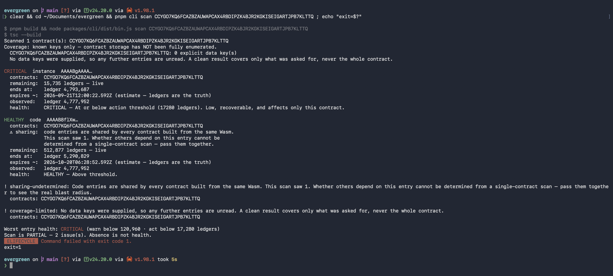

# W3-D18-03 — B crossing, Sunday September 20

**Observed at 2026-09-20 12:00:29.335 UTC (19:00:29.335 WIB): B was below the
normal 17,280-ledger action threshold and the write guard refused it.** The sealed
capture classifies `crossing-refused`, `qualifiesCrossing: true`. This is Rakha's
independent, operator-initiated read-only observation. The agent's scheduled wake-up
started at 18:55 WIB; it is not an unattended GitHub cron save or an expiry proof.

| Observation | Value |
|---|---|
| Subject | `CCYGO7KQ6FCAZBZAUWAPCAX4RBDIPZK4BJR2KGKISEIGARTJPB7KLTTQ` |
| Observed ledger | 4,776,408 |
| B instance remaining / expiry | 17,279 / 4,793,687 |
| B persistent remaining / expiry | 17,280 / 4,793,688 |
| A instance remaining / expiry | 1,593,853 / 6,370,261 |
| Shared Wasm remaining / expiry | 514,421 / 5,290,829 |
| Recorded RPC calls | 5, only `getNetwork` and `getLedgerEntries` |
| Rehearsal | false; no threshold override |
| Transaction / email | None; nothing signed, simulated as a transaction, submitted or sent |

The engine ran in decide-only dry-run mode. B was not added to the scheduled
watched configuration. A/shared-code controls were live. The declared temporary
key was absent; that absence alone is not a new expiry claim. B's persistent key
was still exactly at the threshold while its instance had crossed below it.

## Artifacts and verification

- `capture/`: original sealed checkpoint bundle, including its dot marker,
  raw requests/responses, transport records, manifest, results and checksums.
- `probe.txt`: exact copy of `capture/stdout.txt`, a readable view of the **same**
  observation, not another sample.
- `build-preflight/`: original 10:22 UTC read-only preflight bundle, classified
  `before-action`. Retained only to substantiate the fresh build used by the
  frozen runtime; it is not qualifying crossing evidence.
- `runtime-pin.json`: the 31 runtime hashes pinned before the checkpoint.
- `frozen-capture-runner.txt`: the exact local runner used, retained as text for
  review, not automatically executed by any gate. SHA256:
  `c4ed1a05242d94091f324e2d754bac38ba1ab455a254d124af2db88dc3ce973a`.

Source runtime: `01394cc220eef63e74738a4afb6ec85fb5eac940`, Node24.13.0. Its runtime
inputs match publication base `d6edaff`; the intervening changes are documentation.
The normal CLI built the runtime during the 10:22 UTC preflight. The checkpoint
reused that build through the existing exported `captureCrossingProbe` function,
with pinned hash comparisons before and after capture and replay. **No per-capture
rebuild occurred.** Manifest `freshBuild: true` describes that retained fresh-built
runtime; it does not claim compilation at 12:00. The preflight manifest's hash is
recorded in `runtime-pin.json`, and its unedited copy is retained here.

Strict verification of the original and publication copy both returned exit0,
`crossing-refused`, `qualifiesCrossing: true`; fingerprints remained unchanged.
The checksum inventory contains 21 entries per sealed bundle (22 files including
`SHA256SUMS`). Keep notes and any later screenshots outside those directories.

## `terminal-B-critical.png` — and the one line in it that misleads



A live `evergreen scan` of guinea-pig B taken on the day, showing `CRITICAL`,
`remaining` **15,735** at ledger **4,777,952**, and the two-tier health line
`warn below 120,960 · act below 17,280`.

🔴 **The last line reads `ELIFECYCLE Command failed with exit code 1.` in red. Nothing
failed.** `exit 1` is `EXIT_BELOW_THRESHOLD` — the scan reporting that an entry is below
the action threshold, which is the finding this evidence exists to show. `pnpm` wraps
any non-zero exit as *"Command failed"*, so the wrapper is describing a successful
detection as an error.

This is documented rather than recaptured, because the wrapper's behaviour is itself
worth knowing: see [`CONVENTIONS.md` § A non-zero exit from our own tooling is usually a
finding](../../CONVENTIONS.md). **For later captures, prefer
`node packages/cli/dist/bin.js scan <id> ; echo "exit=$?"`** — same output, explicit exit
code, no wrapper editorialising.
A guard refusal has no transaction hash or explorer transaction screenshot.

To verify on a matching runtime, run:

```sh
node scripts/verify-crossing-capture.mjs docs/evidence/2026-09-20-b-crossing/capture --require-crossing
```

`pnpm check:crossing` also performs semantic replay while permitting historical
runtime fingerprints. Full publication checks run in a separate worktree so they
do not rebuild the retained capture runtime. These are checksums and recorded RPC
responses, not independently signed RPC receipts.

## Remaining checkpoints

Retain this verified live B bundle as Monday's baseline. Do not pull, rebuild or
change the frozen runtime before Monday's expiry observation. Monday07:00,
13:00 and19:00 WIB captures remain outstanding, as does C's required later crossing.
The expiry capture must supply this live baseline, use plain verification without
`--require-crossing`, and actually classify `expiry-observed`; TTL zero is still
live. This one checkpoint does not close W3-D18-03 or the full natural-decay proof.
