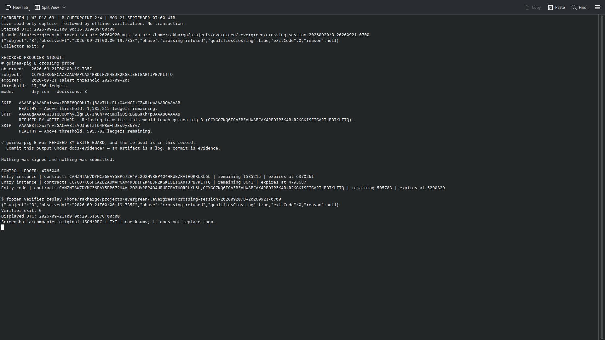

# W3-D18-03 — B checkpoint 2 of 4, Monday 07:00 WIB

**Observed at 2026-09-21 00:00:19.735 UTC / 07:00:19.735 WIB:** B remains live
and actionable. The engine/write guard refused it at the normal 17,280-ledger
threshold. Strict replay returns `crossing-refused`, `qualifiesCrossing: true`.
This is the second scheduled operator checkpoint, executed by Codex after Rakha's
explicit authorization while the operator was away. It is not a GitHub cron save
or an expiry observation. No transaction or email was sent.

| Entry / measurement | Sunday 12:00:29.335 UTC | Monday 00:00:19.735 UTC |
|---|---|---|
| Observed ledger | 4,776,408 | 4,785,046 |
| B instance remaining | 17,279 | 8,641 |
| B persistent remaining | 17,280 | 8,642 |
| B instance expiry | 4,793,687 | 4,793,687 |
| B persistent expiry | 4,793,688 | 4,793,688 |
| Shared Wasm expiry | 5,290,829 | 5,290,829 |

The two observations differ by 8,638 ledgers; B's remaining TTL decreased by the
same amount with unchanged expiry ledgers. A's instance was live with 1,585,215
remaining and shared Wasm was live with 505,783 remaining. The declared temporary
key remained absent. These are two observed states, not proof of uninterrupted
observation or an independently timestamped threshold crossing.

## Retained evidence

- `capture/`: complete original sealed bundle, including `.crossing-capture`,
  five raw read-only RPC requests/responses, transport records, manifest,
  stdout/stderr, result and `SHA256SUMS`. There are21 checksum entries and22 files.
- `probe.txt`: byte-identical copy of the same capture's `stdout.txt`; not a second
  independent observation.
- `terminal-B-0700.png`: actual native Konsole screenshot taken with Spectacle
  after the live collector and offline verifier completed. Visually reviewed:
  the intended terminal, observation, log and successful verification are visible.
  It is not a generated webpage, explorer transaction or synthetic terminal image.
- `terminal-result.json`: actual command, start/display times, collector and
  verifier output/exit codes.
- `screenshot-metadata.json`: hashes binding the screenshot and source manifest,
  method and review scope. Display time is distinct from observation time.
- `terminal-command.py.txt`: exact display/launch helper retained for review as
  text; no gate executes it from this evidence directory.



The screenshot supplements the original JSON/TXT evidence; it does not replace it.
It is outside `capture/` so the sealed inventory remains intact. Nothing was
signed, restored, extended or submitted. There is no transaction hash/explorer
transaction screenshot for this guard refusal.

## Runtime and validation

Frozen source `01394cc220eef63e74738a4afb6ec85fb5eac940`, Node24.13.0, all31 runtime
hashes unchanged. The previously verified fresh-built runtime is reused through
the exported collector; no per-capture rebuild, pull or branch switch occurred
in its checkout. See the [Sunday build and runner provenance](../2026-09-20-b-crossing/README.md).
Manifest `freshBuild` refers to that retained build, not a new compilation today.

The original and publication copy both pass strict offline replay. With a matching
runtime, verify using:

```sh
node scripts/verify-crossing-capture.mjs docs/evidence/2026-09-21-b-crossing-0000/capture --require-crossing
```

Publication builds/checks run in an isolated worktree. The frozen root is checked
again afterward. Raw RPC responses and hashes are retained evidence, not signed
receipts from the RPC provider.

D18-03 remains In progress. Monday13:00 and19:00 WIB and C's later required
crossing remain outstanding. Preserve the Sunday live baseline for the final
expiry capture; require actual `expiry-observed` with plain verification rather
than accepting exit0 alone. TTL zero is still live.
