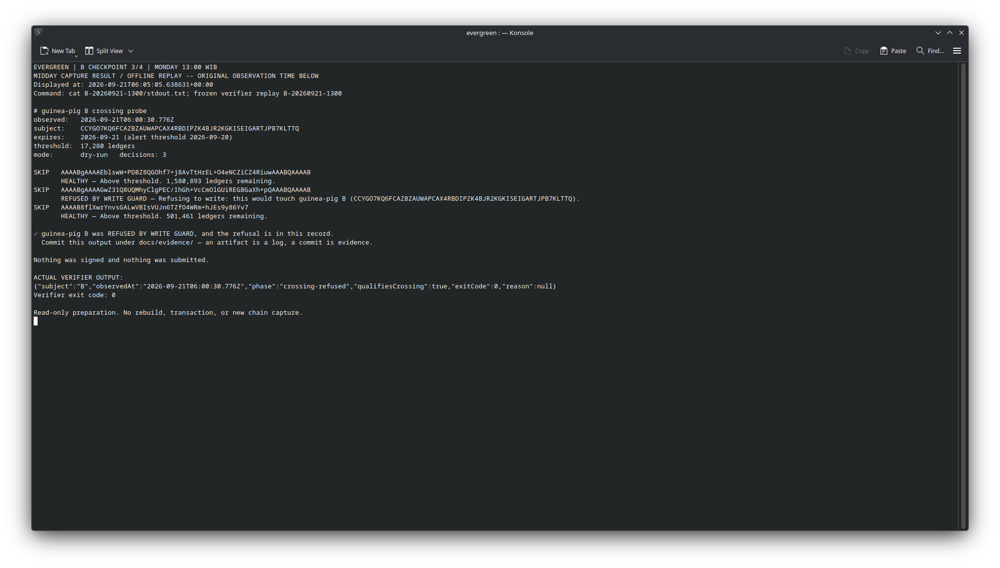

# W3-D18-03 — B checkpoint 3 of 4, Monday 13:00 WIB

**Observed 2026-09-21 06:00:30.776 UTC / 13:00:30.776 WIB:** B remains live with
4,319 instance ledgers remaining. At the normal 17,280 threshold the engine/write
guard refused it. Strict replay returns `crossing-refused`, `qualifiesCrossing: true`.
This is an operator-authorized scheduled agent capture, not a GitHub cron save or
an expiry proof. No transaction, restore, extension or email was sent.

| Measurement | Sunday 12:00 UTC | Monday 00:00 UTC | Monday 06:00 UTC |
|---|---|---|---|
| Actual observed ledger | 4,776,408 | 4,785,046 | 4,789,368 |
| B instance remaining | 17,279 | 8,641 | 4,319 |
| B persistent remaining | 17,280 | 8,642 | 4,320 |
| B instance expiry | 4,793,687 | 4,793,687 | 4,793,687 |
| B persistent expiry | 4,793,688 | 4,793,688 | 4,793,688 |
| Shared Wasm expiry | 5,290,829 | 5,290,829 | 5,290,829 |

Since morning, ledger increased by4,322 and B's remaining TTL fell by4,322.
A instance and shared Wasm controls remain live (1,580,893 and501,461 remaining).
The declared temporary key remained absent. These are recorded observations,
not proof of uninterrupted polling or an exact wall-clock expiry prediction.

## Evidence retained together

- `capture/`: unchanged sealed22-file bundle with21 checksum entries, raw JSON/RPC
  requests/responses, transports, stdout/stderr, manifest and result. Five calls,
  only `getNetwork` and `getLedgerEntries`, no rehearsal.
- `probe.txt`: exact copy of this bundle's stdout, not a separate observation.
- `terminal-result.json` and `terminal-command.py.txt`: actual live terminal capture
  command, timing, collector/verifier output and the helper retained as text.
- `terminal-B-1300.png`: **actual Konsole screenshot of the stored midday result
  and a fresh offline replay**, visibly labelled as such. Initial screenshot
  attempts selected unrelated windows; those images are excluded. The successful
  image was made after reopening the original output at about06:05 UTC. It is not
  a photograph at06:00:30, a second live read, a generated webpage or an explorer.
- `verification.json` and `replay-display.py.txt`: the later replay's real output,
  timestamp and display helper.
- `screenshot-metadata.json`: image and source-manifest hashes, observation versus
  replay-display times, method and visual-review result.



The screenshot supplements, and never replaces, raw JSON/TXT evidence. All visual
files and notes are outside the sealed `capture/` directory. A refusal has no
transaction hash or explorer transaction screenshot. Helpers are archived as text,
not executed by the evidence gate.

## Verification and remaining work

Frozen runtime01394cc220eef63e74738a4afb6ec85fb5eac940, Node24.13.0, all31 hashes
unchanged. The collector reused the previously verified fresh build through its
existing exported function; no per-capture rebuild/pull/switch in the capture root.
See [Sunday provenance](../2026-09-20-b-crossing/README.md) and
[morning checkpoint](../2026-09-21-b-crossing-0000/README.md).

Original and copied bundles pass strict replay. With the matching runtime:

```sh
node scripts/verify-crossing-capture.mjs docs/evidence/2026-09-21-b-crossing-0600/capture --require-crossing
```

Publication builds/tests use an isolated worktree and the frozen root is rechecked
for drift afterward. Checksums and retained RPC responses are not signed provider
receipts. Keep the Sunday live baseline for tonight; do not modify sealed bundles.

D18-03 remains In progress: final19:00 WIB expiry checkpoint, C's later crossing
and acceptance remain outstanding. For expiry both B entries must be absent past
their known ends (observed ledger >=4,793,689), with required controls intact and
an earlier verified live baseline. Require `expiry-observed` with plain verifier,
not exit0 alone and not `--require-crossing`. TTL zero is still live.
