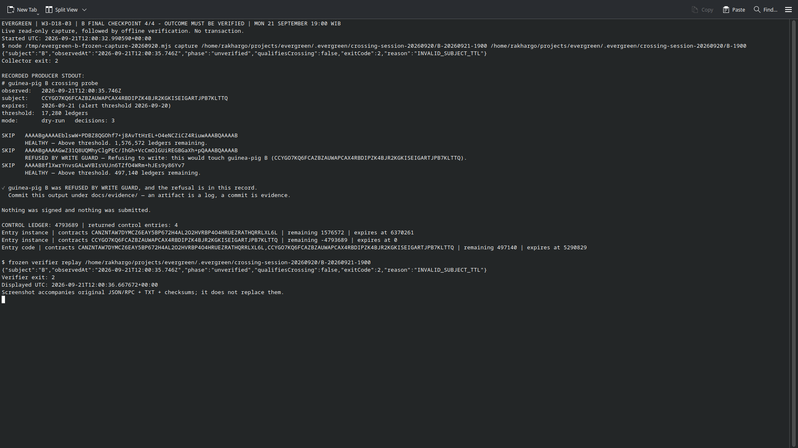

# W3-D18-03 — final B checkpoint attempts; expiry acceptance blocked

**The final checkpoint was collected on time, but it has NOT passed the frozen
expiry verifier.** All three sealed attempts classify `unverified`, reason
`INVALID_SUBJECT_TTL`, exit2. There is no `expiry-observed` result and no4/4
acceptance claim. Follow-up: [issue214](https://github.com/Fatihmaull/evergreen/issues/214),
registered as W3-D18-03a. No original artifact has been edited to change its result.

| Attempt (UTC, September21) | Latest control ledger | Result |
|---|---|---|
| 12:00:35.746 (19:00:35.746 WIB) | 4,793,689 | unverified / INVALID_SUBJECT_TTL |
| 12:02:24.652 | 4,793,711 | same |
| 12:04:29.000 | 4,793,736 | same |

## What the raw response actually contains

The verified Sunday baseline records B instance expiry4,793,687 and persistent
expiry4,793,688. At every attempt above, the observed ledger is past both ends.
However `getLedgerEntries` still returns both B XDR entries, each with explicit
**`liveUntilLedgerSeq: 0`**. Their `lastModifiedLedgerSeq` remains4,512,933.
A instance and shared code controls remain present with valid expiries6,370,261
and5,290,829, unchanged from the earlier observations. The temporary key is absent.

The official public [RPC method documentation](https://developers.stellar.org/docs/data/apis/rpc/api-reference/methods/getLedgerEntries)
states that `liveUntilLedgerSeq` may be zero when the entry is no longer live.
**This absolute-field zero is not remaining TTL zero.** Remaining TTL zero at a
known real end ledger is still live; do not confuse the two meanings.

The current producer treats that returned zero as an absolute expiry and computes
negative remaining TTL. `classifyObservation` rejects the returned instance in
its `INVALID_SUBJECT_TTL` branch before reaching its absence-based expiry branch.
Thus these responses are consistent with the documented non-live representation,
but the frozen verifier cannot certify them as `expiry-observed`. Neither an RPC
outage nor an unauthorized extension is established by this result. A successful
producer log alone does not override the failed wrapper/verification phase.

A compatibility correction must be reviewed and tested offline against retained
records, without changing the frozen capture runtime or rewriting these manifests.
Further identical polling is not itself a fix for the documented representation.
Three bounded reads were retained; no threshold was changed and no restore,
extension, simulation, transaction or email was sent.

## Retained artifacts

- `attempts/120035/`, `attempts/120224/`, `attempts/120429/`: complete sealed bundles,
  each including its verified live Sunday baseline, five original read-only RPC
  requests/responses, transport records, result, manifest, stdout/stderr and
  checksums. Their unverified verdicts are preserved.
- `attempts-summary.json`: index of actual observation times and results.
- `terminal-B-first-expiry-attempt.png`: actual native Konsole screenshot of the
  first live capture and plain offline verification, visibly returning exit2.
- `terminal-result.json`, `terminal-command.py.txt`, `screenshot-metadata.json`:
  actual command/output, source helper retained as text, observation/display times
  and screenshot/source-manifest hashes. No gate executes the archived helper.

All screenshot/supporting files sit outside sealed directories. No producer-log
copy is promoted into standalone qualifying evidence. Screenshots supplement raw
JSON/TXT and cannot make this a passing expiry result. A guard refusal has no
transaction hash or explorer transaction screenshot.

## Verification scope

Frozen source01394cc220eef63e74738a4afb6ec85fb5eac940, Node24.13.0,31 fingerprints
unchanged. All attempts use the real Sunday live baseline and the existing exported
collector with the retained build. No capture-root rebuild/pull/switch occurred.

Checksums and strict replay reproduce each **unverified/exit2** outcome. This
verifies integrity/reproducibility, not expiry acceptance. The repository crossing
gate can remain green from previous valid crossing captures; green CI therefore
must not be presented as a passing final expiry checkpoint. Publication checks run
only in a separate worktree.

D18-03 is blocked on the verifier compatibility review in #214. Three earlier B
checkpoints passed; final acceptance and C's required later capture remain open.
The time-bound raw observations and live baseline are retained for review.
